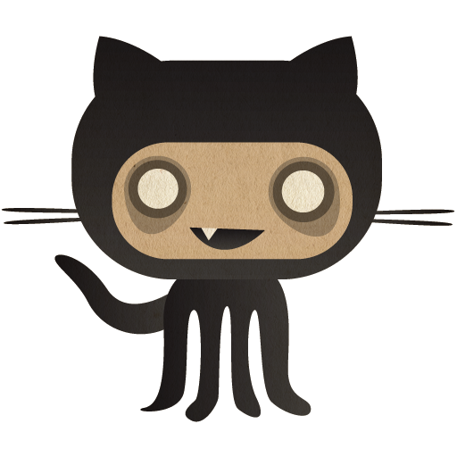

    

<!--- Adding Header Elements -->

    &nbsp;&nbsp;&nbsp;&nbsp;
    &nbsp;&nbsp;&nbsp;&nbsp;
    &nbsp;&nbsp;&nbsp;&nbsp;
    &nbsp;&nbsp;
    

-----------------------------------------------------------

**💫 About Me:**  
✨ I'm an AI/ML enthusiast 
⚡ Exploring multiple tech stacks 
📫 My interest lie in Web development 
👯 Love Java don't know why          

**💻Tech Stack:**  

<b>Languages:</b>&nbsp;&nbsp;&nbsp;
    &nbsp;&nbsp;
    &nbsp;&nbsp;
    &nbsp;&nbsp;
    &nbsp;&nbsp;
    &nbsp;&nbsp;
    &nbsp;&nbsp;
    &nbsp;&nbsp;
    &nbsp;&nbsp;
       
<b>Libraries & Frameworks:</b>&nbsp;&nbsp;&nbsp;
    &nbsp;&nbsp;
    &nbsp;&nbsp;
    &nbsp;&nbsp;
    &nbsp;&nbsp;
    &nbsp;&nbsp;
    &nbsp;&nbsp;
    &nbsp;&nbsp;
    &nbsp;&nbsp;
    &nbsp;&nbsp;
       
    <b>Tools & Platforms:</b>&nbsp;&nbsp;&nbsp;
    &nbsp;&nbsp;
    &nbsp;&nbsp;
    &nbsp;&nbsp;
    &nbsp;&nbsp;
    &nbsp;&nbsp;
    &nbsp;&nbsp;
    &nbsp;&nbsp;
    &nbsp;&nbsp;

  

<h2 style="color:#e8df7a; display: flex; align-items: center;">
    
        LeetCode Stats:
</h2>

    
    

<h2 style="color:#e8df7a; display: flex; align-items: center;">
    
        GitHub Stats:
    
</h2>

     
     
    &nbsp;&nbsp;&nbsp;
     
    

<h3 style="color:#e8df7a;">✍️ Random Dev Quote</h3>

<!-- 
 
  
<h2>📕 Top Projects I've Contributed To</h2>

  <!-- Small repo cards https://github.com/DenverCoder1/github-readme-stats (fork of anuraghazra/github-readme-stats) -->
  <!-- 

    
    
    
    
    
    
    
  
  

  

    
  

 --> 