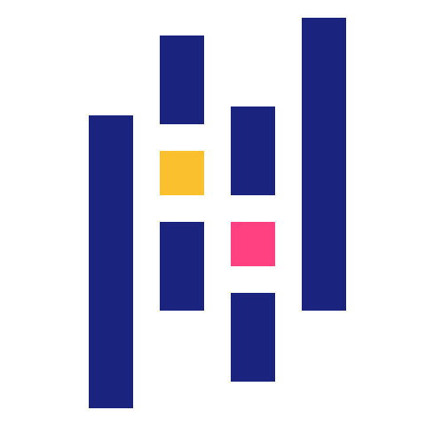

# 💫 About Me:
I'm an AI/ML enthusiast and exploring multiple tech stacks My interest lie in Web development. Fun fact is: Love Java don't know why

## 💬 Connect with me:
   

# 💻 Tech Stack:

# 📊 LeetCode Stats:
  

# 📊 GitHub Stats:
 
 

### ✍️ Random Dev Quote

---

<!-- Proudly created with GPRM ( https://gprm.itsvg.in ) -->
